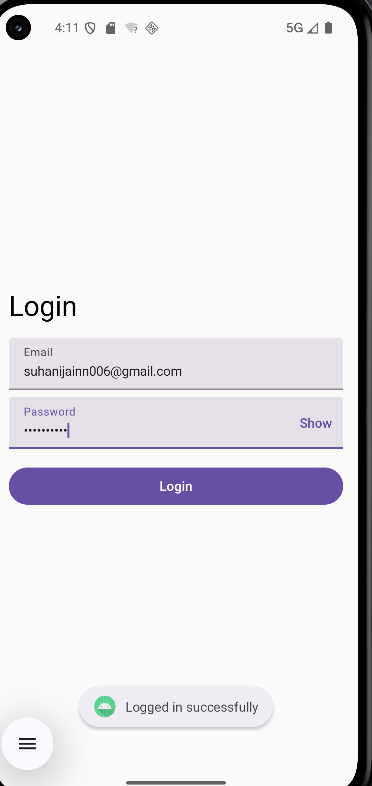

# 🔐 Compose Login App

A simple Android app built with Jetpack Compose to practice basic UI elements like Text, Buttons, TextField, and painterResource. The app demonstrates a minimal login screen with email and password input, show/hide password functionality, and a login button.

# ✨ Features

Email and Password input fields

Password show/hide toggle

Login button with Toast message

Built using Jetpack Compose Material 3

# screeenshots
### LOGIN SCREEN

# 🛠️ Tech Stack

Kotlin

Jetpack Compose (UI)

Material 3 Components

# 🎯 Purpose

This project was created to learn and practice Jetpack Compose basics, including layouts, input fields, and button handling.
